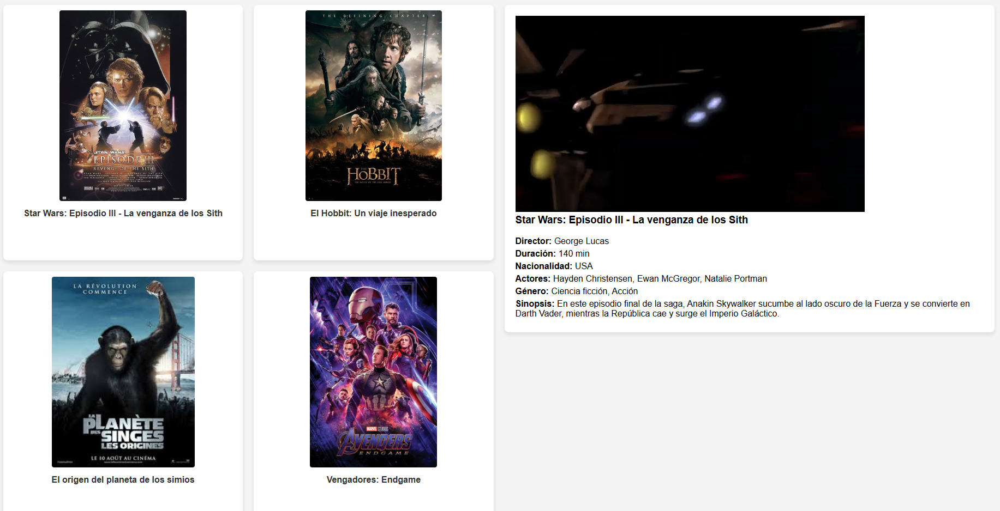

# 

Este proyecto es una aplicación web que muestra una lista de películas con sus detalles. Utilizando tecnologías como **HTML**, **CSS** y **JavaScript**, esta aplicación permite visualizar las películas, ver sus trailers y obtener información adicional de forma dinámica.

## 🚀 Tecnologías utilizadas

- **HTML**: Estructura y presentación de la página web.
- **CSS**: Diseño visual y estilo de la interfaz de usuario.
- **JavaScript**: Dinámica en el lado del cliente, para cargar el XML, mostrar las películas e interactuar con el contenido.
- **XML**: Almacena la información de las películas, como título, director, actores y trailer.

## 📂 Estructura del Proyecto

La estructura del proyecto está organizada de la siguiente manera:

- **index.html**: Contiene la estructura básica de la página con las secciones de visualización de películas y detalles.
- **styles.css**: Contiene los estilos visuales para que la página tenga una interfaz atractiva y organizada.
- **script.js**: Contiene la lógica para cargar el archivo XML con la información de las películas, mostrar las imágenes y trailers, y manejar la interacción con los usuarios.
- **peliculas.xml**: Archivo XML con la información de las películas (títulos, imágenes, trailers, etc.).
- **img/**: Carpeta con las imágenes de las películas y los trailers descargados.

## 📜 Funcionalidades

Este proyecto incluye las siguientes funcionalidades:

- **Mostrar lista de películas**: Las películas se cargan desde el archivo XML y se muestran con su título e imagen en una vista tipo grid.
- **Ver trailers**: Al hacer clic en una película, se muestra su trailer correspondiente utilizando un reproductor de video local.
- **Mostrar información de la película**: Al hacer clic en una película, se despliega información adicional como director, actores, duración, nacionalidad, género y sinopsis.
- **Interacción dinámica**: Los detalles de cada película se cargan sin necesidad de recargar la página, utilizando JavaScript para manipular el DOM.

## 🛠️ Instalación

Para ejecutar este proyecto en tu máquina local, sigue estos pasos:

1. **Clona el repositorio**:
   ```bash
   git clone https://github.com/daniarranz/PracticaXML.git
